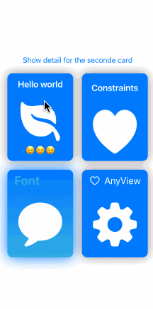

# SimpleCardView-SwiftUI


`SimpleCardView-SwiftUI` is a very simple card view written with SwiftUI

[中文说明](./README-zh.md)



## CardView structure


## Example

``` Swift
CardView(
    size: CGSize(width: 150.0, height: 200.0),
    title: "Hello World",
    cover: {
        Image(systemName: "leaf.fill")
            .resizable()
            .foregroundColor(.white)
            .frame(width: 100.0, height: 100.0)
    }, detail: {
        VStack(spacing: 20.0) {
            Text("Sheet")
                .font(.largeTitle)
                .foregroundColor(.white)
            
            Image(systemName: "moon.stars.fill")
                .resizable()
                .scaledToFit()
                .padding()
                .foregroundColor(.yellow)
        }
        .frame(maxWidth: .infinity, maxHeight: .infinity)
        .background(.cyan)
})
.backgroundColor(colors: [.cyan, .blue])
```

To run the example project, clone the repo, and run `pod install` from the Example directory first.

## Interfaces

### Initialization
```swift 
init(
    size: CGSize, 
    title: String, 
    titleViewProportion: CGFloat = 1 / 4, // the proportion (of height) of the TitleView
    spacing: CGFloat = 0.0, 
    detailViewType: CardDetailsViewType = .sheet, // how the DetailView will display
    detailViewBinding: Binding<Bool>? = nil, // add a binding to control the visibility of the DetailView
    cover: () -> Cover, 
    detail: () -> Detail, 
    onTap action: (() -> ())? = nil
)
```

### Methods for `BackgroundView`
``` swift
// Set the background color of the card
func backgroundColor(_ color: Color) 

// Set the background color of the card as linear gradient
func backgroundColor(colors: [Color], startPoint: UnitPoint = .top, endPoint: UnitPoint = .bottom) 

// Set the corner radius of the card
func cardCornerRadius(_ radius: CGFloat)

// Set the shadow of the card
func cardShadow(color: Color? = nil, radius: CGFloat, xOffset: CGFloat? = nil, yOffset: CGFloat? = nil)
```

### Methods for `TitleView`
```swift
// Replace the default title view with a new `AnyView`
func replaceTitleView(with alternativeView: AnyView)

// Set the title string of the title view
func title(_ title: String)

// Set the font of the title
func titleFont(_ font: Font)

// Set the text color of the title
func titleColor(_ color: Color)

// Set the alignment of the title
func titleAlignment(_ alignment: HorizontalAlignment)

// Set the truncation mode of the title
func titleTruncationMode(_ mode: Text.TruncationMode)
```

Execute Xcode's `Product > Build Documentation` and go to `SimpleCardView-SwiftUI`'s documentation for more details.

## Requirements

Swift >= 5.0

## Installation

SimpleCardView-SwiftUI is available through [CocoaPods](https://cocoapods.org). To install
it, simply add the following line to your Podfile:

```ruby
pod 'SimpleCardView-SwiftUI'

# Note that if you are installing 0.0.2 version, please try the command below
# pod 'SimpleCardView-SwiftUI', :git => 'https://github.com/Tomortec/SimpleCardView-SwiftUI.git'
```

## Author

Tomortec, everything@tomortec.com

## License

SimpleCardView-SwiftUI is available under the MIT license. See the LICENSE file for more info.
