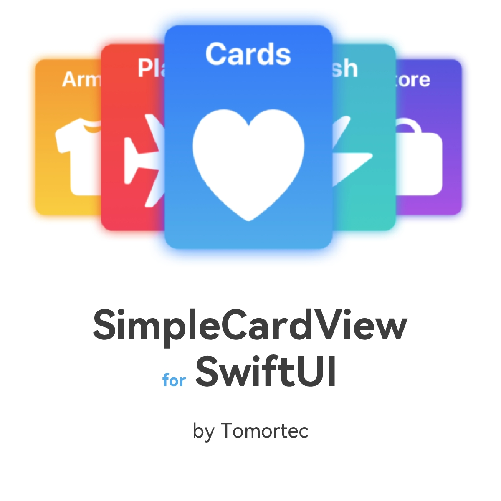

# SimpleCardView-SwiftUI

[](https://travis-ci.org/36720212/SimpleCardView-SwiftUI)
[](https://cocoapods.org/pods/SimpleCardView-SwiftUI)
[](https://cocoapods.org/pods/SimpleCardView-SwiftUI)
[](https://cocoapods.org/pods/SimpleCardView-SwiftUI)

`SimpleCardView-SwiftUI` is a very simple card view written with SwiftUI



## Example

``` Swift
struct CardView_Previews: PreviewProvider {
    static var previews: some View {
        HStack(spacing: 20.0) {
            CardView(
            size: CGSize(width: 150.0, height: 200.0), 
            title: "Hello world", 
            backgroundColorTop: .blue, 
            backgroundColorBottom: .cyan, 
            cover: {
                Image(systemName: "heart.fill")
                    .resizable()
                    .frame(width: 120, height: 120)
            }, detail: {
                Image(systemName: "star.fill")
                    .resizable()
                    .scaledToFit()
                    .padding()
                    .foregroundColor(.yellow)
            })
            
            CardView(
            size: CGSize(width: 150.0, height: 200.0), 
            title: "Hello world", 
            backgroundColorTop: .blue, 
            backgroundColorBottom: .cyan, 
            cover: {
                Image(systemName: "gearshape.fill")
                    .resizable()
                    .frame(width: 120, height: 120)
            }, detail: {
                Image(systemName: "moon.stars.fill")
                    .resizable()
                    .scaledToFit()
                    .padding()
                    .foregroundColor(.yellow)
            })
        }
    }
}
```

To run the example project, clone the repo, and run `pod install` from the Example directory first.

## Requirements

Swift >= 5.0

## Installation

SimpleCardView-SwiftUI is available through [CocoaPods](https://cocoapods.org). To install
it, simply add the following line to your Podfile:

```ruby
pod 'SimpleCardView-SwiftUI'
```

## Author

Tomortec, everything@tomortec.com

## License

SimpleCardView-SwiftUI is available under the MIT license. See the LICENSE file for more info.
